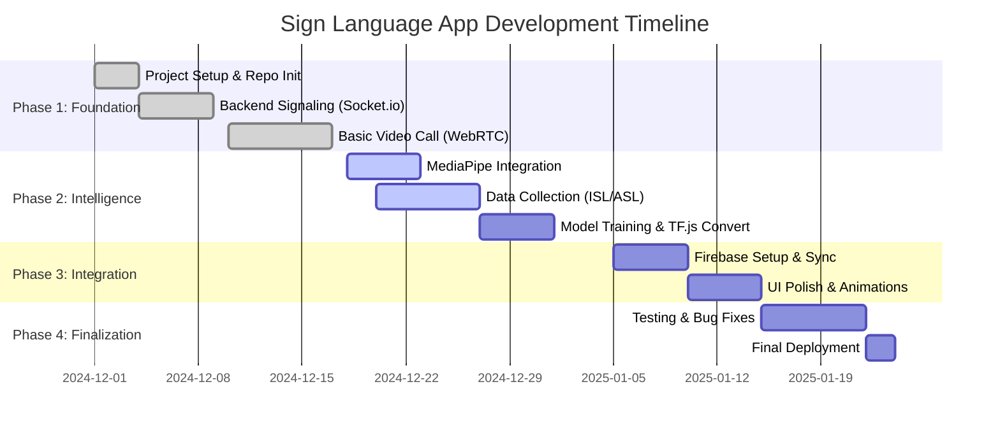

# Project Documentation: Sign Language Video Call Application

## 1. Team Composition & Roles (4 Members)

To ensure efficient development and management of the Sign Language Video Call API, the team is divided into four specialized roles:

### 1. Project Lead & Backend Architect
*   **Responsibilities**:
    *   Oversees the overall architecture and system design.
    *   Manages the Node.js/Express server and `server.js` logic.
    *   Handles real-time communication protocols (Socket.io) and WebRTC signaling.
    *   Ensures security and scalability of the backend infrastructure.
*   **Key Deliverables**: Robust signaling server, efficient room management, secure API endpoints.

### 2. Frontend & UI/UX Developer
*   **Responsibilities**:
    *   Develops the user interface (`index.html`, `style.css`).
    *   Ensures a responsive design that works on Desktop and Mobile.
    *   Implements dynamic interactions (Video grid, Chat UI, Mode switching).
    *   Focuses on accessibility and visual aesthetics (Glassmorphism, animations).
*   **Key Deliverables**: Polished Join Screen, In-Call Interface, Responsive Layouts.

### 3. AI/ML Engineer
*   **Responsibilities**:
    *   Integrates MediaPipe for real-time hand tracking.
    *   Develops and trains the Machine Learning models (ISL/ASL) using Python/TensorFlow.
    *   Handles the conversion of models to TensorFlow.js format.
    *   Optimizes model inference performance in the browser.
*   **Key Deliverables**: Trained `model.json`, accurate landmark detection pipeline, `script.js` prediction logic.

### 4. Data Specialist & QA Engineer
*   **Responsibilities**:
    *   Manages Firebase integration (Firestore, Authentication, Hosting).
    *   Oversees data collection pipelines for training datasets.
    *   Conducts rigorous testing (Unit functionality, Cross-browser compatibility, Network latency tests).
    *   Maintains project documentation and deployment pipelines.
*   **Key Deliverables**: Firebase project setup, verified datasets, bug reports, final deployment.

---

## 2. Project Workflow

The project follows an **Agile/Iterative** development workflow:

1.  **Planning & Requirements**: Define core features (Video, Chat, ML) and user stories.
2.  **Design & Prototyping**: Create UI mockups and database schema (Firebase).
3.  **Core Development**:
    *   Set up Server (Node/Socket.io).
    *   Build Frontend Skeleton.
    *   Integrate ML Libraries.
4.  **Integration**: Connect Frontend to Backend; Connect app to Firebase.
5.  **Testing & Refinement**: Peer testing, latency checks, model accuracy tuning.
6.  **Deployment**: Deploy to Firebase Hosting / Cloud Platforms.

---

## 3. Gantt Chart (Timeline)

---

## 4. Milestones

| Milestone ID | Description | Status |
| :--- | :--- | :--- |
| **M1** | **Project Initialization**: Repository setup, Node.js environment configured. | ✅ Completed |
| **M2** | **Signaling & Connectivity**: Socket.io server working for real-time messaging. | ✅ Completed |
| **M3** | **Video Telephony**: WebRTC video/audio streams functioning between peers. | ✅ Completed |
| **M4** | **Hand Visualization**: MediaPipe landmarks drawing correctly on video feed. | 🔄 In Progress |
| **M5** | **SL Recognition**: TensorFlow.js model predicting gestures (ISL/ASL) in real-time. | ⏳ Pending |
| **M6** | **Cloud Persistence**: User data and chat history saving to Firebase Firestore. | ⏳ Pending |
| **M7** | **Product Launch**: Fully polished UI, optimized performance, hosted online. | ⏳ Pending |

---

## 5. Current Progress Report

*   **Backend**: The `server.js` acts as a robust signaling server using Express and Socket.io. Room joining logic is implemented.
*   **Video**: Basic Peer-to-Peer video implementation is in place, allowing users to see each other.
*   **ML/AI**: The structure for training is set up (`training/` folder). TensorFlow.js dependency is added.
*   **Database**: Firebase dependencies (`firebase`, `.firebaserc`) are installed and configured (`firebase.json`).
*   **Frontend**: `index.html` and `style.css` provide the basic interface for the video call application.

---

## 6. Technical Challenges & Mitigation Measures

| # | Technical Challenge | Mitigation Measure |
| :--- | :--- | :--- |
| **1** | **WebRTC Connection Failures** Direct P2P connections failing on restrictive networks or firewalls. | **TURN Servers**: Deploy/Integrate TURN servers (e.g., coturn or paid services like Twilio) to relay traffic when direct P2P fails. |
| **2** | **ML Model Performance** TensorFlow.js running slowly on low-end devices, causing video lag. | **Optimization**: Use `tf.tidy()` to clean up tensors. Use the WebGL backend for acceleration. Limit prediction frequency (e.g., every 100ms instead of every frame). |
| **3** | **Gesture Recognition Accuracy** Model confusing similar signs (e.g., 'A' vs 'M' in ASL) due to occlusion or lighting. | **Data Augmentation**: Train with varied lighting and angles. Implement a "confidence threshold" before displaying the result to avoid flickering false positives. |
| **4** | **Firebase Quota Limits** Exceeding free tier limits for Firestore reads/writes during active chat/video sessions. | **Batching & Throttling**: Batch updates where possible. Only write "significant" events or chat messages. Cache static data locally. |
| **5** | **Synchronization** Ensuring both users see the same "Translation" result at the same time. | **WebSocket Events**: Emit recognized gestures via Socket.io so the remote peer sees the text instantly alongside the video feed. |
